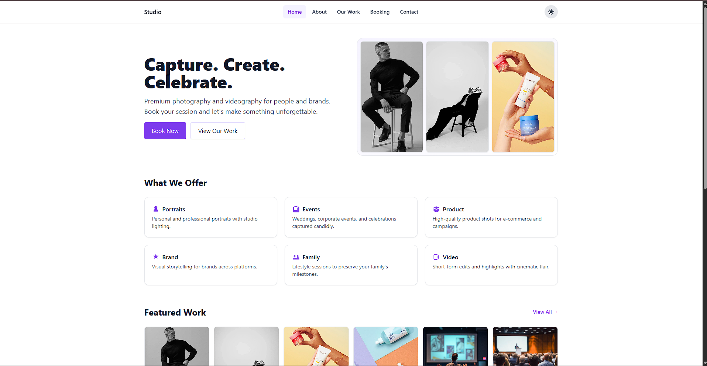
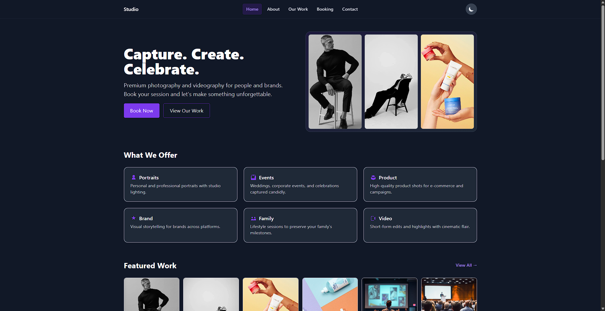

# CaptureLife Studio

<p align="center">
  
  <h1 align="center">CaptureLife Studio</h1>
  <p align="center">A modern, responsive photography portfolio website with booking system and dark/light theme support</p>
  
  [](https://reactjs.org/)
  [](https://vitejs.dev/)
  [](https://tailwindcss.com/)
  [](https://opensource.org/licenses/MIT)
</p>

## 🌟 Features

- 🌓 **Dark/Light Mode** with system preference detection
- 📱 **Fully Responsive** design for all devices
- ⚡ **Blazing Fast** performance with Vite + React
- 🎨 **Modern UI** with Tailwind CSS
- 📅 **Booking System** for client appointments
- 📱 **Mobile-First** approach
- 🌍 **Multi-page** navigation
- 🎨 **Custom Animations** and transitions

## 🚀 Getting Started

### Prerequisites

- Node.js 16.14.0 or later
- npm or yarn package manager

### Installation

1. Clone the repository:
   ```bash
   git clone https://github.com/yourusername/capturelife-studio.git
   cd capturelife-studio/studio
   ```

2. Install dependencies:
   ```bash
   npm install
   # or
   yarn install
   ```

3. Start the development server:
   ```bash
   npm run dev
   # or
   yarn dev
   ```

4. Open [http://localhost:5173](http://localhost:5173) to view it in your browser.

### Building for Production

```bash
npm run build
# or
yarn build
```

## 🛠️ Tech Stack

- **Frontend Framework**: React 18
- **Build Tool**: Vite
- **Styling**: Tailwind CSS
- **Icons**: Heroicons
- **Routing**: React Router
- **State Management**: React Context API
- **Form Handling**: HTML5 Forms with custom validation

## 📂 Project Structure

```
src/
├── assets/          # Static assets (images, fonts, etc.)
├── components/      # Reusable UI components
│   ├── Header.jsx   # Navigation header
│   ├── ThemeToggle.jsx # Theme switcher
│   └── ...
├── contexts/        # React Context providers
│   └── ThemeContext.jsx
├── pages/           # Page components
│   ├── Home.jsx
│   ├── About.jsx
│   ├── Portfolio.jsx
│   ├── Services.jsx
│   ├── Booking.jsx
│   └── Contact.jsx
├── App.jsx          # Main App component with routes
└── main.jsx         # Application entry point
```


## 📸 Screenshots

| Home Page (Light) | Home Page (Dark) |
|-------------------|------------------|
|  |  |


## 🎨 Theming

This project supports both light and dark themes with system preference detection. The theme can be toggled using the theme switcher in the header.

## 🤝 Contributing

Contributions are welcome! Please follow these steps:

1. Fork the repository
2. Create your feature branch (`git checkout -b feature/AmazingFeature`)
3. Commit your changes (`git commit -m 'Add some AmazingFeature'`)
4. Push to the branch (`git push origin feature/AmazingFeature`)
5. Open a Pull Request

## 📄 License

Distributed under the MIT License. See `LICENSE` for more information.

## 📧 Contact


- **Name**: Velmurugan V  
- **LinkedIn**: [https://www.linkedin.com/in/velmuruganv11/](https://www.linkedin.com/in/velmuruganv11/)  
- **GitHub**: [https://github.com/Velmuruganvaradharaj1122](https://github.com/Velmuruganvaradharaj1122)  
- **Email**: velmuruganvaradharj@gmail.com

Project Link: [https://github.com/Velmuruganvaradharaj1122/CaptureLifeStudio](https://github.com/Velmuruganvaradharaj1122/CaptureLifeStudio)


## 🙏 Acknowledgments

- [React Icons](https://react-icons.github.io/react-icons/)
- [Tailwind CSS](https://tailwindcss.com/)
- [Vite](https://vitejs.dev/)
- [Heroicons](https://heroicons.com/)

---

<p align="center">
  Made with ❤️ by velmurugan V
</p>
